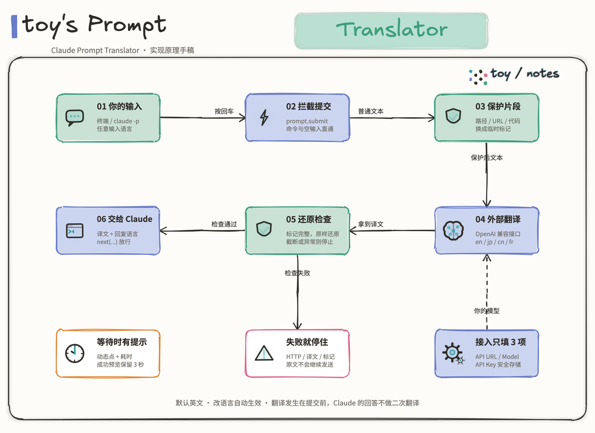

# Claude Prompt Translator

把提示词翻译成指定语言，再交给 Claude Code。翻译使用你配置的外部模型接口，默认英文，支持 `en / jp / cn / fr`。

**接入只需要：安装插件 → 填模型接口 → 选目标语言。** 日常仍然直接运行 `claude`。

```text
你的输入 -> 外部翻译接口 -> 译文 -> Claude Code
               |
               +-> 翻译进度、耗时、译文预览
```

## toy 的实现原理手稿



[可缩放 SVG](assets/architecture/principle.svg) · [可编辑 Excalidraw](assets/architecture/principle.excalidraw)

## 视频演示

[](https://www.youtube.com/watch?v=VBJLDWzfLpI)

[在 YouTube 观看：Claude 多语言Prompt 转换](https://www.youtube.com/watch?v=VBJLDWzfLpI)

本页继续说明怎么安装和接入；实际使用效果见视频。

## 1. 安装插件

先确认 Claude Code 可运行。本项目在 **Claude Code 2.1.291** 上验证，使用同版本或更新版本。

在终端执行：

```bash
claude plugin marketplace add cfrs2005/claude-prompt-translator
claude plugin install prompt-translator@claude-prompt-translator
```

然后运行 `claude`。已有会话可以执行 `/reload-plugins` 加载新安装的插件。

## 2. 接入翻译模型

在 Claude Code 中执行：

```text
/plugin configure prompt-translator@claude-prompt-translator
```

填写下面三项。这里的 API Key 属于翻译服务；Claude Code 的登录继续按你原来的方式使用。

| 字段 | 怎么填 |
| --- | --- |
| **API URL** | 完整的 OpenAI 兼容 `chat/completions` 地址，不能只填域名或 `/v1` |
| **Translation model** | 翻译接口支持的模型 ID |
| **API Key** | 该翻译接口的密钥，输入会遮罩并存入 Claude Code 的安全存储 |

默认提供 GLM 接入值，只需填写自己的 Key：

```text
API URL:           https://open.bigmodel.cn/api/coding/paas/v4/chat/completions
Translation model: glm-5.3-flash
Reasoning effort:  low
```

换成其他服务时，同时修改 **API URL** 和 **Translation model**。如果接口不接受 `reasoning_effort`，把 **Reasoning effort** 选为 `default`，插件就不会发送这个字段。

接入自己的网关或本地模型，请看 [模型接入说明](docs/integration.md)。

## 3. 选择语言并检查

在 `/config` 中找到本插件的 **Target language**：

| 代码 | 目标语言 |
| --- | --- |
| `en` | 英文，默认 |
| `jp` | 日文 |
| `cn` | 简体中文 |
| `fr` | 法文 |

语言选项会同时控制提示词翻译和 Claude 的回复语言。修改后自动生效。

提交一句普通文本，例如“请简要介绍这个项目”。输入框上方会显示：

```text
+---------------------------------------------+
| 翻译中...  1.2 秒 · 英文 (en) · glm-5.3-flash |
| 自动识别 -> 英文                             |
+---------------------------------------------+
> 
```

成功后显示译文预览，3 秒后收起。失败时显示原因并停止这次提交，原文不会被悄悄放行。命令、空输入和以 `! / #` 开头的输入直接放行。

查看安装状态：

```bash
claude plugin list
```

## 更新和停用

```bash
claude plugin marketplace update claude-prompt-translator
claude plugin update prompt-translator@claude-prompt-translator
```

更新后在当前会话运行 `/reload-plugins`。

```bash
claude plugin disable prompt-translator@claude-prompt-translator
```

停用后重新加载插件或重新打开 Claude Code。

## 接口与数据

- 接口须使用 OpenAI 兼容请求，并返回 `choices[0].message.content`。
- 提示词正文会发送到你配置的翻译服务；使用该服务的密钥和额度。
- 路径、URL、行内代码和完整代码块会先替换成标记，翻译后原样放回。标记缺失时停止提交。
- 即使输入已是目标语言，也会调用翻译接口，并要求原文返回。
- Claude 的回复语言通过随提交附带的指令引导；插件不翻译 Claude 已生成的回答。
- 动态提示框用于 Claude Code 终端的交互会话。`claude -p` 同样翻译，但不显示提示框。

## 更多说明

- [模型接入、环境变量与故障排查](docs/integration.md)
- [开发和验证](CONTRIBUTING.md)
- [MIT License](LICENSE)
- [Claude Code 插件安装](https://code.claude.com/docs/en/plugins/install)
- [Claude Code Mods API](https://code.claude.com/docs/en/plugins/mods/api)
